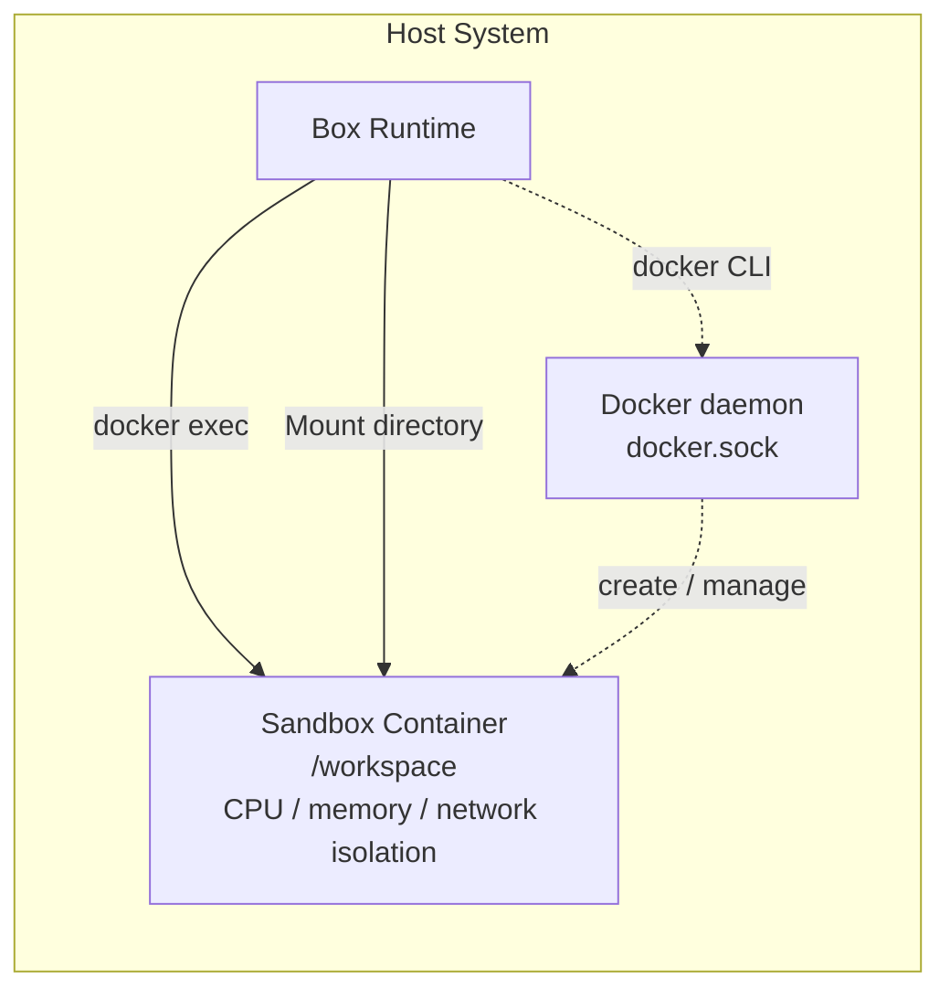
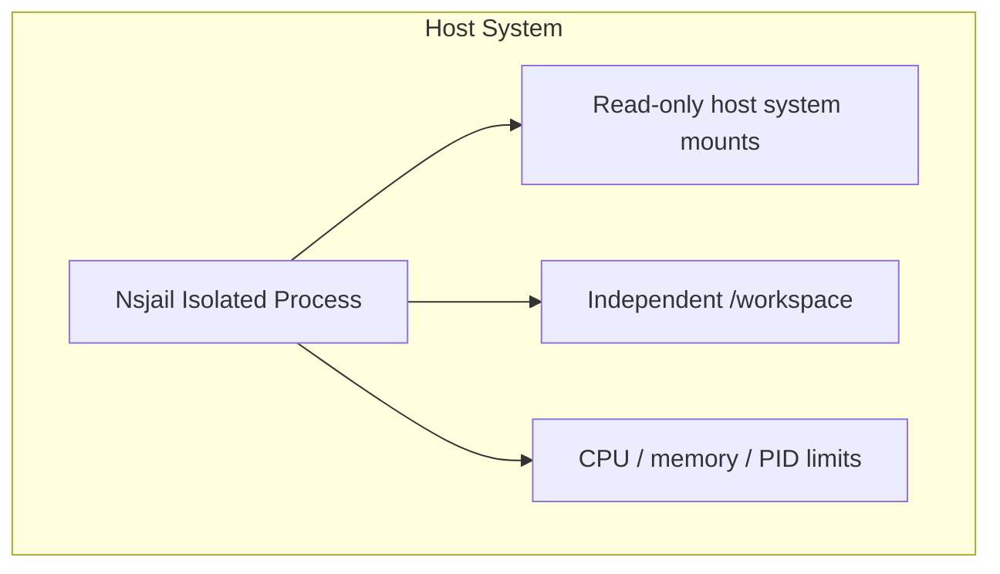

LangBot supports three sandbox backends. Choose the appropriate one based on your deployment environment.

## Backend Selection

Use the `backend` config option to select a backend:

| Value | Description |
|--------|------|
| `local` | Local backend, auto-selects between Docker and Nsjail (recommended) |
| `docker` | Force Docker backend |
| `nsjail` | Force Nsjail backend |
| `e2b` | Force E2B cloud sandbox |

<Note>
`box.backend` can be set with the LangBot config override environment variable `BOX__BACKEND`. In containerized deployments, set `box.local.*` overrides on the `langbot` service; LangBot forwards them to Box Runtime through the INIT RPC. Do not set `LANGBOT_BOX_*` / `BOX__*` directly on `langbot_box`, because the Box Runtime does not read them from its own environment.
</Note>

### Auto-Selection Logic

When `backend: 'local'`, backends are selected in this order:

1. **Docker** - If `docker` CLI is available
2. **Nsjail** - If `nsjail` binary is available
3. Error - No available backend

| Backend | Name | Dependency | Features |
|---------|------|------|------|
| **Docker** | `docker` | `docker` CLI | Full container isolation, most recommended |
| **Nsjail** | `nsjail` | `nsjail` binary | Lightweight Linux sandbox |
| **E2B** | `e2b` | `e2b` Python package | Cloud sandbox service |

---

## Docker Backend

The most recommended solution, providing complete container isolation.

### Prerequisites

- Docker Engine 20.10+ installed
- Docker daemon running
- Box Runtime process has permission to execute `docker` commands

### How It Works

The Box Runtime creates and manages sandbox containers through Docker CLI:



<Note>
The Box Runtime communicates with Docker daemon via `docker` CLI. In containerized deployments, mount `docker.sock` on `langbot_box`.
</Note>

### Containerized Deployment

When LangBot runs in a Docker container, run the Box Runtime as a separate `langbot_box` service. `langbot_box` mounts the host Docker socket and creates sandbox containers:

```yaml
# docker-compose.yaml
services:
  langbot_box:
    image: rockchin/langbot:latest
    container_name: langbot_box
    profiles: ["box", "all"]
    volumes:
      # Keep source and target identical because langbot_box creates
      # sandbox containers through the host Docker socket.
      - ${LANGBOT_BOX_ROOT:-${PWD}/data/box}:${LANGBOT_BOX_ROOT:-${PWD}/data/box}
      # Mount the socket for your container runtime:
      # - /var/run/podman/podman.sock:/var/run/podman/podman.sock   # Podman
      - /var/run/docker.sock:/var/run/docker.sock
    restart: on-failure
    environment:
      - TZ=Asia/Shanghai
      # Box Runtime does not read box.local.* from config/env directly;
      # LangBot sends these settings through the INIT RPC.
    command: ["uv", "run", "--no-sync", "-m", "langbot_plugin.cli.__init__", "box"]

  langbot:
    image: rockchin/langbot:latest
    container_name: langbot
    volumes:
      - ./data:/app/data
    restart: on-failure
    environment:
      - TZ=Asia/Shanghai
      - BOX__LOCAL__HOST_ROOT=${LANGBOT_BOX_ROOT:-${PWD}/data/box}
      - BOX__LOCAL__DEFAULT_WORKSPACE=default
      - BOX__LOCAL__SKILLS_ROOT=skills
      - BOX__LOCAL__ALLOWED_MOUNT_ROOTS=${LANGBOT_BOX_ROOT:-${PWD}/data/box}
```

<Warning>
Mounting `docker.sock` gives `langbot_box` the ability to create other containers. Use only in trusted environments.
</Warning>

### Configuration Example

```yaml
box:
  backend: 'local'
  local:
    profile: 'default'
    image: ''                    # Empty uses default image
    host_root: './data/box'      # Host working directory
    default_workspace: ''        # Default workspace
    skills_root: 'skills'        # Skill package directory, defaults to <host_root>/skills
    allowed_mount_roots:         # Whitelist of mountable directories
      - './data/box'
      - '/tmp'
    workspace_quota_mb: null     # Disk quota
```

### Custom Image

Default uses `rockchin/langbot-sandbox:latest` image. You can specify a custom image:

```yaml
box:
  local:
    image: 'python:3.11-slim'
```

Custom image requirements:
- Linux-based
- Contains `sh` shell
- Contains required runtimes (Python, Node.js, etc.)

---

## Nsjail Backend

Lightweight Linux sandbox, no container runtime required.

### Prerequisites

- Linux system (macOS/Windows not supported)
- `nsjail` binary installed
- cgroup v2 support (recommended)

### Installing nsjail

```bash
# Ubuntu/Debian
apt-get install nsjail

# Or build from source
git clone https://github.com/google/nsjail
cd nsjail
make
```

### How It Works

Nsjail uses Linux kernel features (namespace, cgroup, seccomp) to create isolated environments:



### Features

| Advantages | Limitations |
|------------|-------------|
| No container runtime needed | Linux only |
| Fast startup | No custom images |
| Low resource usage | Uses host system environment |

### Configuration Example

```yaml
box:
  backend: 'local'
  local:
    profile: 'offline_readonly'  # Recommended readonly mode
    host_root: './data/box'
```

<Warning>
Nsjail backend uses host system environment, `image` config has no effect. Recommended to use with `offline_readonly` profile.
</Warning>

---

## E2B Cloud Sandbox

Use E2B cloud sandbox service, no local infrastructure needed.

### Prerequisites

- E2B API Key (get from [e2b.dev](https://e2b.dev))
- Install `e2b` Python package: `pip install e2b`

### Configuration Example

```yaml
box:
  backend: 'e2b'
  e2b:
    api_key: 'your-api-key'      # Or set E2B_API_KEY env var
    api_url: ''                  # Custom API URL (optional)
    template: ''                 # Default template ID
```

### Environment Variables

Can also configure via environment variables:

```bash
export E2B_API_KEY='your-api-key'
export E2B_API_URL='https://your-self-hosted-e2b.com'  # optional
```

### Template System

E2B uses templates to define sandbox environments:

```yaml
box:
  e2b:
    template: 'python-3.11'  # Use Python 3.11 template
```

Common templates:
- `base` - Basic environment
- `python-3.11` - Python 3.11 environment
- Custom template ID

### Self-Hosted E2B

If you deployed self-hosted E2B service:

```yaml
box:
  backend: 'e2b'
  e2b:
    api_key: 'your-api-key'
    api_url: 'https://your-e2b-server.com'
```

---

## Backend Comparison

| Feature | Docker | Nsjail | E2B |
|---------|--------|--------|-----|
| Full isolation | ✅ | ⚠️ Partial | ✅ |
| Custom images | ✅ | ❌ | ✅ (templates) |
| Network control | ✅ | ✅/depends on nsjail setup | ⚠️ Depends on E2B/CubeSandbox template |
| Resource limits | ✅ | ✅/best effort | ⚠️ Depends on provider/template |
| Linux support | ✅ | ✅ | ✅ |
| macOS support | ✅ | ❌ | ✅ |
| Windows support | ✅ | ❌ | ✅ |
| Local dependency | Docker | nsjail | None |
| Cost | Free | Free | Pay per use |

## Selection Guide

| Scenario | Recommended Backend |
|----------|---------|
| Production | Docker |
| Linux server lightweight deploy | Nsjail |
| No local infrastructure | E2B |
| Development testing | Docker |
| Cross-platform consistency | E2B |
