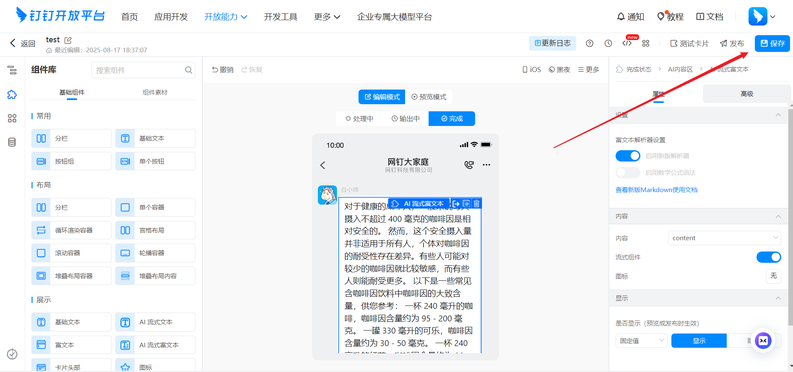
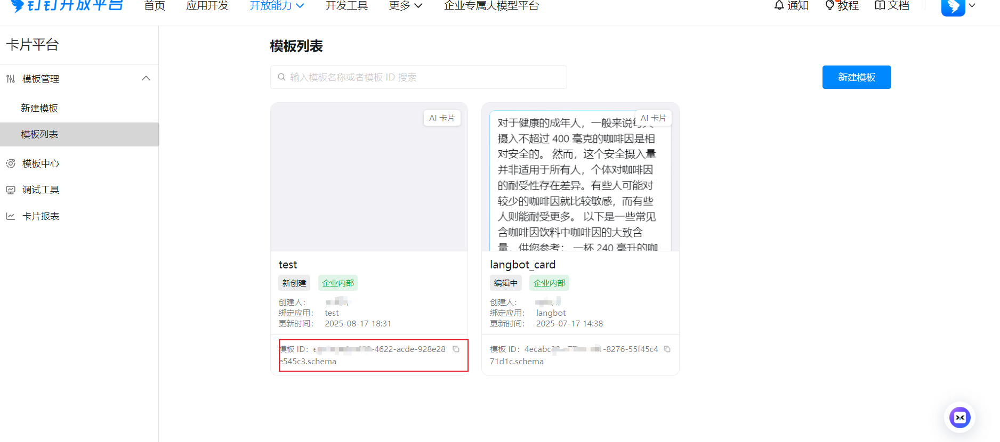
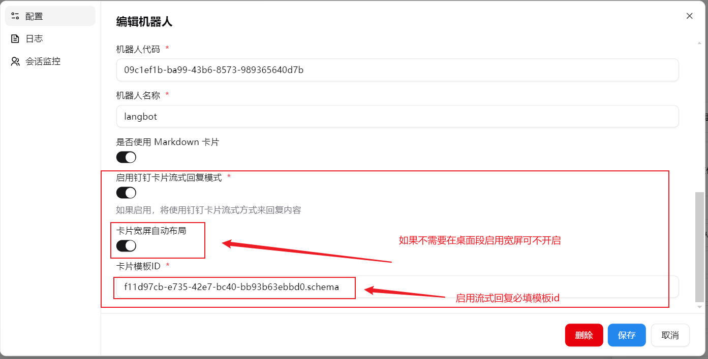

DingTalk に LangBot をデプロイします。

## 一键設定（おすすめ）

LangBot は DingTalk アプリのワンクリック作成とクレデンシャルの自動入力に対応しています。手動でのコピペは不要です。

1. LangBot WebUI を開き、**ボット > ボットを作成** に移動
2. ボット名を入力し、プラットフォーム/アダプターで `钉钉` を選択
3. 表示される **一键创建应用** エリアで **開始** ボタンをクリック

4. DingTalk で QR コードをスキャンし、手机端で组织を選択

5. **新しいボットを作成** または **既存のボットを選択** できます

6. 認証成功後、手机端に「設定成功」と表示され、Client ID と Client Secret が LangBot WebUI に**自動入力**されます

7. **ボット名を手動で入力**（DingTalk のボット名と一致させる必要があります）と**ロボットコード**（画像/ファイル機能に必須、DingTalk 開発者コンソール > ボット設定から取得）を入力

8. **送信** をクリックして完了

<Warning>
一键設定後、テキストの送受信はすぐに利用できます。ただし：
- **画像/ファイル対応**：ロボットコード（RobotCode）の入力が必要です。一键設定時に未入力の場合は、DingTalk 開発者コンソール > ボット設定から取得して入力してください
- **ストリーミング返信**：カードテンプレート ID の手動設定が必要です。下記「ボットの設定」のカードテンプレート作成セクションを参照してください
</Warning>

---

## 手動設定

### ボットの作成

[DingTalk 開発者バックエンド](https://open-dev.dingtalk.com/?spm=ding_open_doc.document.0.0.74f445e5MkawbT#/)にアクセスし、ログインして組織に入ります。ログインに成功したら、オープンプラットフォームに入ります。以下のように表示されます：

上部の「アプリケーション開発」をクリックし、右側の青いボタン「アプリケーションを作成」をクリックして、ボットの基本情報を入力し、保存をクリックします。

ボットのバックエンドに入ります。例えば、langbot2 という名前のボットがある場合、管理ページは以下のように表示されます：

### ボットの設定

「アプリケーション機能を追加」、「その他のアプリケーション機能」、「ロボット」の「設定」をクリックし、設定をクリックして情報を入力します。以下のように：

ページ下部の「公開」をクリックし、公開が成功したら、ボットページの左下にある「バージョン管理と公開」をクリックします。以下のように：

初めてボットを作成する場合、右側は空なので、「新しいバージョンを作成」をクリックし、その中で情報を設定し、「アプリケーションの表示範囲」を設定して、保存をクリックします。

「イベントサブスクリプション」をクリックし、プッシュ方式を「ストリームモードプッシュ」に変更します。

カードストリーミングが必要な場合は、権限管理でカード権限を申請する必要があります。以下のように：

さらに、カードメッセージの場合、主にカードテンプレートを作成し、テンプレート ID を記録して設定に入力する必要があります。手順は以下の通りです：
> カードコンテンツテンプレート ID は、開発者バックエンドにログイン > [カードプラットフォーム](https://open-dev.dingtalk.com/fe/card?spm=ding_open_doc.document.0.0.33cf2281L0fXsV)から取得できます

新しいテンプレートを作成する際に情報を入力します。以下のように：

プリセットテンプレートを選択します（最初のものを選択し、後でテンプレートの内容を変更します）。以下のように：

使用をクリック

作成

作成をクリックすると、テンプレートの編集にリダイレクトされます。以下のように、希望するカードメッセージを自由に編集できます：

メインコンテンツについては、デフォルトの「content」をそのままにしておきます：

ワイドスクリーン設定パラメータ。テンプレート変数に . を追加する必要があります。参考[DingTalk ワイドスクリーン設定](https://open.dingtalk.com/document/development/configure-widescreen-cards)

編集を終え、すべて正しいことを確認したら、保存してテンプレート ID をコピーし、設定ファイルに入力します：

### 設定情報の入力

「認証情報と基本情報」をクリックし、「Client ID」と「Client Secret」を記録します。
「アプリケーション機能」、「ロボット」をクリックし、RobotCode とロボット名を記録します。
`markdown_card` は Markdown 形式の返信を有効にするかどうかです。この設定項目が無効になっている場合、`@送信者` 設定スイッチは有効になりません。
上記の設定項目を記録し、LangBot ボット設定フォームに入力します

[カードプラットフォーム](https://open-dev.dingtalk.com/fe/card?spm=ding_open_doc.document.0.0.33cf2281L0fXsV)をクリックし、テンプレートリストから対応するバインドされたテンプレート ID をコピーし、カードテンプレート ID フィールドに入力します。

ストリーミング関連：

**LangBot を起動します**。

### ボットの追加

この記事では DingTalk Windows デスクトップ版を例として使用します。上部の「検索」、「機能」をクリックし、先ほど作成したボットの名前を入力します。以下のように：

ボットをクリックしてチャットします。

グループに追加したい場合は、DingTalk グループの「グループ管理」、「ロボット」、「ロボットを追加」をクリックし、ボット名を検索してグループで使用します。
