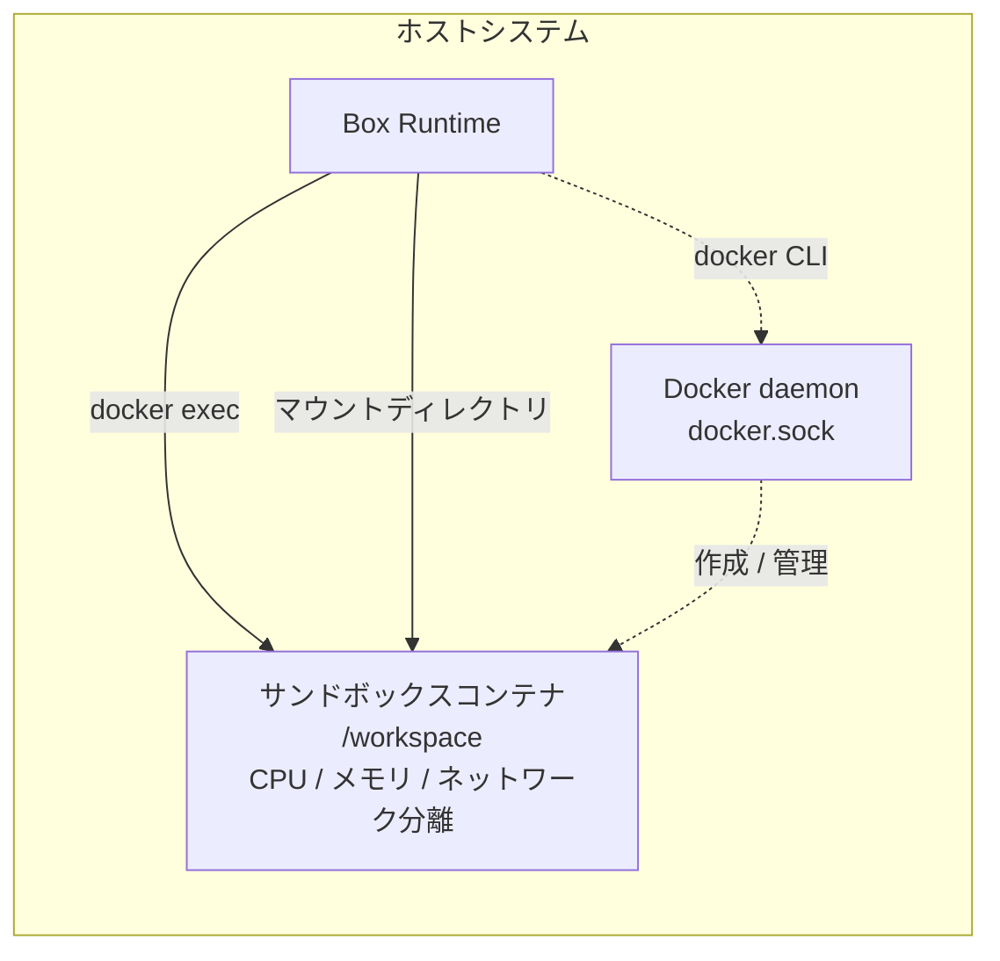
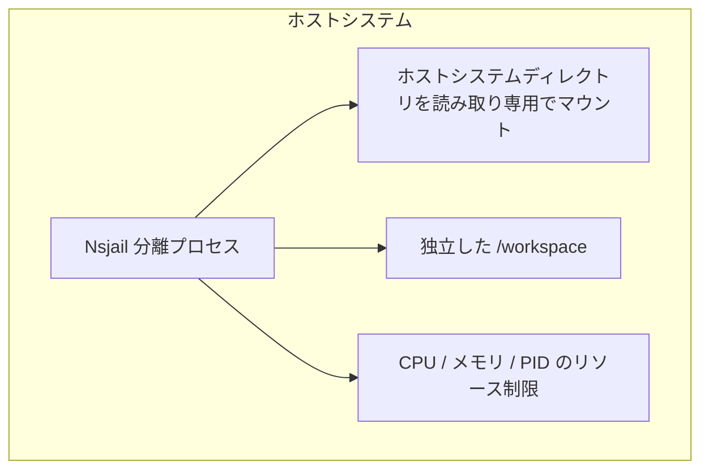

LangBotは3つのサンドボックスバックエンドをサポートしています。デプロイ環境に合わせて適切なものを選択してください。

## バックエンド選択

`backend`設定でバックエンドを選択します：

| 値 | 説明 |
|--------|------|
| `local` | ローカルバックエンド、DockerとNsjailを自動選択（推奨） |
| `docker` | Dockerバックエンドを強制 |
| `nsjail` | Nsjailバックエンドを強制 |
| `e2b` | E2Bクラウドサンドボックスを強制 |

<Note>
`box.backend` は LangBot 設定上書き環境変数 `BOX__BACKEND` で設定できます。コンテナ化デプロイでは、`box.local.*` の上書きは `langbot` サービスに設定し、LangBot が INIT RPC 経由で Box Runtime に渡します。`LANGBOT_BOX_*` / `BOX__*` を `langbot_box` サービスに直接設定しても、Box Runtime は自身の環境変数から読み取りません。
</Note>

### 自動選択ロジック

`backend: 'local'`の場合、以下の順序で選択されます：

1. **Docker** - `docker` CLIが利用可能な場合
2. **Nsjail** - `nsjail`バイナリが利用可能な場合
3. エラー - 利用可能なバックエンドなし

| バックエンド | 名前 | 依存関係 | 特徴 |
|-------------|------|------|------|
| **Docker** | `docker` | `docker` CLI | 完全なコンテナ分離、最も推奨 |
| **Nsjail** | `nsjail` | `nsjail` binary | 軽量Linuxサンドボックス |
| **E2B** | `e2b` | `e2b` Pythonパッケージ | クラウドサンドボックスサービス |

---

## Dockerバックエンド

最も推奨されるソリューション、完全なコンテナ分離を提供。

### 前提条件

- Docker Engine 20.10+がインストール済み
- Docker daemonが実行中
- Box Runtime プロセスが `docker` コマンドを実行する権限を持つ

### 仕組み

Box Runtime は Docker CLI を通じてサンドボックスコンテナを作成・管理：



<Note>
Box Runtime は `docker` CLI を通じて Docker daemon と通信します。コンテナ化デプロイでは `langbot_box` に `docker.sock` をマウントします。
</Note>

### コンテナ化デプロイ

LangBot が Docker コンテナで実行される場合、Box Runtime を独立した `langbot_box` サービスとして実行します。`langbot_box` がホスト Docker socket をマウントし、サンドボックスコンテナを作成します：

```yaml
# docker-compose.yaml
services:
  langbot_box:
    image: rockchin/langbot:latest
    container_name: langbot_box
    profiles: ["box", "all"]
    volumes:
      # langbot_box はホスト Docker socket 経由でサンドボックスコンテナを作成するため、
      # ソースパスとターゲットパスを同一にします。
      - ${LANGBOT_BOX_ROOT:-${PWD}/data/box}:${LANGBOT_BOX_ROOT:-${PWD}/data/box}
      # 利用するコンテナランタイムの socket をマウントします：
      # - /var/run/podman/podman.sock:/var/run/podman/podman.sock   # Podman
      - /var/run/docker.sock:/var/run/docker.sock
    restart: on-failure
    environment:
      - TZ=Asia/Shanghai
      # Box Runtime は box.local.* を config/env から直接読みません。
      # これらの設定は LangBot から INIT RPC 経由で渡されます。
    command: ["uv", "run", "--no-sync", "-m", "langbot_plugin.cli.__init__", "box"]

  langbot:
    image: rockchin/langbot:latest
    container_name: langbot
    volumes:
      - ./data:/app/data
    restart: on-failure
    environment:
      - TZ=Asia/Shanghai
      - BOX__LOCAL__HOST_ROOT=${LANGBOT_BOX_ROOT:-${PWD}/data/box}
      - BOX__LOCAL__DEFAULT_WORKSPACE=default
      - BOX__LOCAL__SKILLS_ROOT=skills
      - BOX__LOCAL__ALLOWED_MOUNT_ROOTS=${LANGBOT_BOX_ROOT:-${PWD}/data/box}
```

<Warning>
`docker.sock` をマウントすると、`langbot_box` が他のコンテナを作成できるようになります。信頼できる環境でのみ使用してください。
</Warning>

### 設定例

```yaml
box:
  backend: 'local'
  local:
    profile: 'default'
    image: ''                    # 空の場合デフォルトイメージ使用
    host_root: './data/box'      # ホストワーキングディレクトリ
    default_workspace: ''        # デフォルトワークスペース
    skills_root: 'skills'        # Skill パッケージディレクトリ。デフォルトは <host_root>/skills
    allowed_mount_roots:         # マウント可能なディレクトリのホワイトリスト
      - './data/box'
      - '/tmp'
    workspace_quota_mb: null     # ディスククォータ
```

### カスタムイメージ

デフォルトでは`rockchin/langbot-sandbox:latest`イメージを使用。カスタムイメージを指定可能：

```yaml
box:
  local:
    image: 'python:3.11-slim'
```

カスタムイメージの要件：
- Linuxベース
- `sh`シェルを含む
- 必要なランタイム（Python、Node.jsなど）を含む

---

## Nsjailバックエンド

軽量Linuxサンドボックス、コンテナランタイム不要。

### 前提条件

- Linuxシステム（macOS/Windows非対応）
- `nsjail`バイナリがインストール済み
- cgroup v2サポート（推奨）

### nsjailのインストール

```bash
# Ubuntu/Debian
apt-get install nsjail

# またはソースからビルド
git clone https://github.com/google/nsjail
cd nsjail
make
```

### 仕組み

NsjailはLinuxカーネル機能（namespace、cgroup、seccomp）を使用して分離環境を作成：



### 特徴

| 利点 | 制限 |
|------------|-------------|
| コンテナランタイム不要 | Linuxのみ |
| 高速起動 | カスタムイメージ非対応 |
| 低リソース消費 | ホストシステム環境を使用 |

### 設定例

```yaml
box:
  backend: 'local'
  local:
    profile: 'offline_readonly'  # 読み取り専用モード推奨
    host_root: './data/box'
```

<Warning>
Nsjailバックエンドはホストシステム環境を使用するため、`image`設定は無効です。`offline_readonly`プロファイルとの使用を推奨。
</Warning>

---

## E2Bクラウドサンドボックス

E2Bクラウドサンドボックスサービスを使用、ローカルインフラ不要。

### 前提条件

- E2B API Key（[e2b.dev](https://e2b.dev)から取得）
- `e2b` Pythonパッケージのインストール：`pip install e2b`

### 設定例

```yaml
box:
  backend: 'e2b'
  e2b:
    api_key: 'your-api-key'      # またはE2B_API_KEY環境変数を設定
    api_url: ''                  # カスタムAPI URL（オプション）
    template: ''                 # デフォルトテンプレートID
```

### 環境変数

環境変数でも設定可能：

```bash
export E2B_API_KEY='your-api-key'
export E2B_API_URL='https://your-self-hosted-e2b.com'  # オプション
```

### テンプレートシステム

E2Bはテンプレートでサンドボックス環境を定義：

```yaml
box:
  e2b:
    template: 'python-3.11'  # Python 3.11テンプレートを使用
```

一般的なテンプレート：
- `base` - 基本環境
- `python-3.11` - Python 3.11環境
- カスタムテンプレートID

### 自己ホストE2B

自己ホストE2Bサービスをデプロイしている場合：

```yaml
box:
  backend: 'e2b'
  e2b:
    api_key: 'your-api-key'
    api_url: 'https://your-e2b-server.com'
```

---

## バックエンド比較

| 機能 | Docker | Nsjail | E2B |
|---------|--------|--------|-----|
| 完全分離 | ✅ | ⚠️ 一部 | ✅ |
| カスタムイメージ | ✅ | ❌ | ✅ (テンプレート) |
| ネットワーク制御 | ✅ | ✅/nsjail 設定に依存 | ⚠️ E2B/CubeSandbox テンプレートに依存 |
| リソース制限 | ✅ | ✅/best effort | ⚠️ プロバイダー/テンプレートに依存 |
| Linux対応 | ✅ | ✅ | ✅ |
| macOS対応 | ✅ | ❌ | ✅ |
| Windows対応 | ✅ | ❌ | ✅ |
| ローカル依存 | Docker | nsjail | なし |
| コスト | 無料 | 無料 | 従量課金 |

## 選択ガイド

| シナリオ | 推奨バックエンド |
|----------|---------|
| 本番環境 | Docker |
| Linuxサーバー軽量デプロイ | Nsjail |
| ローカルインフラなし | E2B |
| 開発テスト | Docker |
| クロスプラットフォーム一貫性 | E2B |
